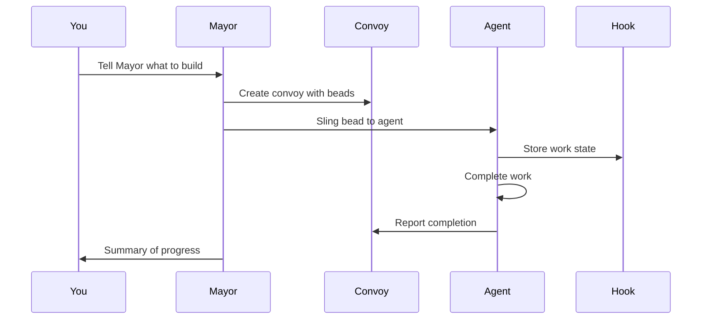
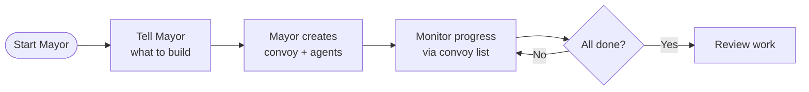
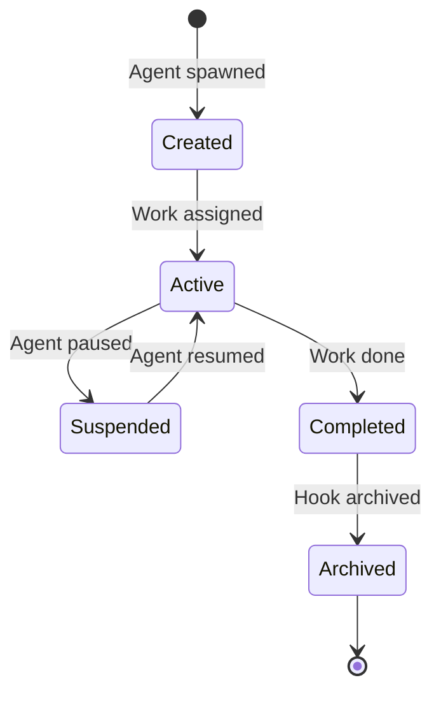

# gt-ville

A [gastown](https://github.com/steveyegge/gastown) town instance for orchestrating multi-agent AI workflows across multiple projects.

## What's Inside

**Town Configuration**
- `mayor/` - The primary AI coordinator with full workspace context
- `deacon/` - Agent configuration for specialized tasks
- `settings/` - Global escalation and configuration files

**Project Rigs** (git-backed project containers)
- `beerai/` - Beer recipe AI project
- `beerxml_python/` - BeerXML parsing library
- `cv/` - Curriculum vitae management
- `agent_learn/` - Agent learning experiments

**Orchestration System**
- `.beads/` - Git-backed issue tracking with 30+ workflow formulas
- `.claude/` - Claude Code integration and handoff commands
- `plugins/` - Extensibility hooks

## Quick Start

```bash
# Prime the mayor with context
gt prime

# Check your work inbox
gt mail inbox

# View active rigs
gt rig list

# Find available work
bd ready

# Start autonomous patrol
gt patrol start
```

## About Gastown

This town uses gastown's multi-agent orchestration model to coordinate 4-30 Claude Code agents simultaneously. Work persists through git-backed hooks, enabling reliable coordination that survives crashes and context limits.

See [AGENTS.md](AGENTS.md) for agent-specific instructions and workflows.

---

## Installation

### Prerequisites

- **Go 1.23+** - [go.dev/dl](https://go.dev/dl/)
- **Git 2.25+** - for worktree support
- **Dolt 1.82.4+** - [github.com/dolthub/dolt](https://github.com/dolthub/dolt)
- **beads (bd) 0.55.4+** - [github.com/steveyegge/beads](https://github.com/steveyegge/beads)
- **sqlite3** - for convoy database queries (usually pre-installed on macOS/Linux)
- **tmux 3.0+** - recommended for full experience
- **Claude Code CLI** (default runtime) - [claude.ai/code](https://claude.ai/code)
- **Codex CLI** (optional runtime) - [developers.openai.com/codex/cli](https://developers.openai.com/codex/cli)

### Setup (Docker-Compose below)

```bash
# Install Gas Town
$ brew install gastown                                    # Homebrew (recommended)
$ npm install -g @gastown/gt                              # npm
$ go install github.com/steveyegge/gastown/cmd/gt@latest  # From source (macOS/Linux)

# Windows (or if go install fails): clone and build manually
$ git clone https://github.com/steveyegge/gastown.git && cd gastown
$ go build -o gt.exe ./cmd/gt
$ mv gt.exe $HOME/go/bin/  # or add gastown to PATH

# If using go install, add Go binaries to PATH (add to ~/.zshrc or ~/.bashrc)
export PATH="$PATH:$HOME/go/bin"

# Create workspace with git initialization
gt install ~/gt --git
cd ~/gt

# Add your first project
gt rig add myproject https://github.com/you/repo.git

# Create your crew workspace
gt crew add yourname --rig myproject
cd myproject/crew/yourname

# Start the Mayor session (your main interface)
gt mayor attach
```

### Docker Compose

```bash
export GIT_USER="<your name>"
export GIT_EMAIL="<your email>"
export FOLDER="/Users/you/code"

docker compose up --build -d

docker compose exec gastown zsh # or bash

gt up

gh auth login #if you want gh to work

gt mayor attach
```

## Quick Start Guide

### Getting Started
Run
```shell
gt install ~/gt --git &&
cd ~/gt &&
gt config agent list &&
gt mayor attach
```
and tell the Mayor what you want to build!

---

### Basic Workflow



### Example: Feature Development

```bash
# 1. Start the Mayor
gt mayor attach

# 2. In Mayor session, create a convoy with bead IDs
gt convoy create "Feature X" gt-abc12 gt-def34 --notify --human

# 3. Assign work to an agent
gt sling gt-abc12 myproject

# 4. Track progress
gt convoy list

# 5. Monitor agents
gt agents
```

## Common Workflows

### Mayor Workflow (Recommended)

**Best for:** Coordinating complex, multi-issue work



**Commands:**

```bash
# Attach to Mayor
gt mayor attach

# In Mayor, create convoy and let it orchestrate
gt convoy create "Auth System" gt-x7k2m gt-p9n4q --notify

# Track progress
gt convoy list
```

### Minimal Mode (No Tmux)

Run individual runtime instances manually. Gas Town just tracks state.

```bash
gt convoy create "Fix bugs" gt-abc12   # Create convoy (sling auto-creates if skipped)
gt sling gt-abc12 myproject            # Assign to worker
claude --resume                        # Agent reads mail, runs work (Claude)
# or: codex                            # Start Codex in the workspace
gt convoy list                         # Check progress
```

### Beads Formula Workflow

**Best for:** Predefined, repeatable processes

Formulas are TOML-defined workflows embedded in the `gt` binary (source in `internal/formula/formulas/`).

**Example Formula** (`internal/formula/formulas/release.formula.toml`):

```toml
description = "Standard release process"
formula = "release"
version = 1

[vars.version]
description = "The semantic version to release (e.g., 1.2.0)"
required = true

[[steps]]
id = "bump-version"
title = "Bump version"
description = "Run ./scripts/bump-version.sh {{version}}"

[[steps]]
id = "run-tests"
title = "Run tests"
description = "Run make test"
needs = ["bump-version"]

[[steps]]
id = "build"
title = "Build"
description = "Run make build"
needs = ["run-tests"]

[[steps]]
id = "create-tag"
title = "Create release tag"
description = "Run git tag -a v{{version}} -m 'Release v{{version}}'"
needs = ["build"]

[[steps]]
id = "publish"
title = "Publish"
description = "Run ./scripts/publish.sh"
needs = ["create-tag"]
```

**Execute:**

```bash
# List available formulas
bd formula list

# Run a formula with variables
bd cook release --var version=1.2.0

# Create formula instance for tracking
bd mol pour release --var version=1.2.0
```

### Manual Convoy Workflow

**Best for:** Direct control over work distribution

```bash
# Create convoy manually
gt convoy create "Bug Fixes" --human

# Add issues to existing convoy
gt convoy add hq-cv-abc gt-m3k9p gt-w5t2x

# Assign to specific agents
gt sling gt-m3k9p myproject/my-agent

# Check status
gt convoy show
```

## Runtime Configuration

Gas Town supports multiple AI coding runtimes. Per-rig runtime settings are in `settings/config.json`.

```json
{
  "runtime": {
    "provider": "codex",
    "command": "codex",
    "args": [],
    "prompt_mode": "none"
  }
}
```

**Notes:**

- Claude uses hooks in `.claude/settings.json` (managed via `--settings` flag) for mail injection and startup.
- For Codex, set `project_doc_fallback_filenames = ["CLAUDE.md"]` in
  `~/.codex/config.toml` so role instructions are picked up.
- For runtimes without hooks (e.g., Codex), Gas Town sends a startup fallback
  after the session is ready: `gt prime`, optional `gt mail check --inject`
  for autonomous roles, and `gt nudge deacon session-started`.

## Key Commands

### Workspace Management

```bash
gt install <path>           # Initialize workspace
gt rig add <name> <repo>    # Add project
gt rig list                 # List projects
gt crew add <name> --rig <rig>  # Create crew workspace
```

### Agent Operations

```bash
gt agents                   # List active agents
gt sling <bead-id> <rig>    # Assign work to agent
gt sling <bead-id> <rig> --agent cursor   # Override runtime for this sling/spawn
gt mayor attach             # Start Mayor session
gt mayor start --agent auggie           # Run Mayor with a specific agent alias
gt prime                    # Context recovery (run inside existing session)
gt feed                     # Real-time activity feed (TUI)
gt feed --problems          # Start in problems view (stuck agent detection)
```

**Built-in agent presets**: `claude`, `gemini`, `codex`, `cursor`, `auggie`, `amp`, `opencode`, `copilot`, `pi`, `omp`

### Convoy (Work Tracking)

```bash
gt convoy create <name> [issues...]   # Create convoy with issues
gt convoy list              # List all convoys
gt convoy show [id]         # Show convoy details
gt convoy add <convoy-id> <issue-id...>  # Add issues to convoy
```

### Configuration

```bash
# Set custom agent command
gt config agent set claude-glm "claude-glm --model glm-4"
gt config agent set codex-low "codex --thinking low"

# Set default agent
gt config default-agent claude-glm

# View config
gt config show
```

### Beads Integration

```bash
bd formula list             # List formulas
bd cook <formula>           # Execute formula
bd mol pour <formula>       # Create trackable instance
bd mol list                 # List active instances
```

## Cooking Formulas

Gas Town includes built-in formulas for common workflows. See `internal/formula/formulas/` for available recipes.

## Activity Feed

`gt feed` launches an interactive terminal dashboard for monitoring all agent activity in real-time. It combines beads activity, agent events, and merge queue updates into a three-panel TUI:

- **Agent Tree** - Hierarchical view of all agents grouped by rig and role
- **Convoy Panel** - In-progress and recently-landed convoys
- **Event Stream** - Chronological feed of creates, completions, slings, nudges, and more

```bash
gt feed                      # Launch TUI dashboard
gt feed --problems           # Start in problems view
gt feed --plain              # Plain text output (no TUI)
gt feed --window             # Open in dedicated tmux window
gt feed --since 1h           # Events from last hour
```

**Navigation:** `j`/`k` to scroll, `Tab` to switch panels, `1`/`2`/`3` to jump to a panel, `?` for help, `q` to quit.

### Problems View

At scale (20-50+ agents), spotting stuck agents in the activity stream becomes difficult. The problems view surfaces agents needing human intervention by analyzing structured beads data.

Press `p` in `gt feed` (or start with `gt feed --problems`) to toggle the problems view, which groups agents by health state:

| State | Condition |
|-------|-----------|
| **GUPP Violation** | Hooked work with no progress for an extended period |
| **Stalled** | Hooked work with reduced progress |
| **Zombie** | Dead tmux session |
| **Working** | Active, progressing normally |
| **Idle** | No hooked work |

**Intervention keys** (in problems view): `n` to nudge the selected agent, `h` to handoff (refresh context).

## Dashboard

Gas Town includes a web dashboard for monitoring your workspace. The dashboard
must be run from inside a Gas Town workspace (HQ) directory.

```bash
# Start dashboard (default port 8080)
gt dashboard

# Start on a custom port
gt dashboard --port 3000

# Start and automatically open in browser
gt dashboard --open
```

The dashboard gives you a single-page overview of everything happening in your
workspace: agents, convoys, hooks, queues, issues, and escalations. It
auto-refreshes via htmx and includes a command palette for running gt commands
directly from the browser.

## Advanced Concepts

### The Propulsion Principle

Gas Town uses git hooks as a propulsion mechanism. Each hook is a git worktree with:

1. **Persistent state** - Work survives agent restarts
2. **Version control** - All changes tracked in git
3. **Rollback capability** - Revert to any previous state
4. **Multi-agent coordination** - Shared through git

### Hook Lifecycle



### MEOW (Mayor-Enhanced Orchestration Workflow)

MEOW is the recommended pattern:

1. **Tell the Mayor** - Describe what you want
2. **Mayor analyzes** - Breaks down into tasks
3. **Convoy creation** - Mayor creates convoy with beads
4. **Agent spawning** - Mayor spawns appropriate agents
5. **Work distribution** - Beads slung to agents via hooks
6. **Progress monitoring** - Track through convoy status
7. **Completion** - Mayor summarizes results

## Shell Completions

```bash
# Bash
gt completion bash > /etc/bash_completion.d/gt

# Zsh
gt completion zsh > "${fpath[1]}/_gt"

# Fish
gt completion fish > ~/.config/fish/completions/gt.fish
```

## Project Roles

| Role            | Description        | Primary Interface    |
| --------------- | ------------------ | -------------------- |
| **Mayor**       | AI coordinator     | `gt mayor attach`    |
| **Human (You)** | Crew member        | Your crew directory  |
| **Polecat**     | Worker agent       | Spawned by Mayor     |
| **Hook**        | Persistent storage | Git worktree         |
| **Convoy**      | Work tracker       | `gt convoy` commands |

## Tips

- **Always start with the Mayor** - It's designed to be your primary interface
- **Use convoys for coordination** - They provide visibility across agents
- **Leverage hooks for persistence** - Your work won't disappear
- **Create formulas for repeated tasks** - Save time with Beads recipes
- **Use `gt feed` for live monitoring** - Watch agent activity and catch stuck agents early
- **Monitor the dashboard** - Get real-time visibility in the browser
- **Let the Mayor orchestrate** - It knows how to manage agents

## Troubleshooting

### Agents lose connection

Check hooks are properly initialized:

```bash
gt hooks list
gt hooks repair
```

### Convoy stuck

Force refresh:

```bash
gt convoy refresh <convoy-id>
```

### Mayor not responding

Restart Mayor session:

```bash
gt mayor detach
gt mayor attach
```

## License

MIT License - see LICENSE file for details
